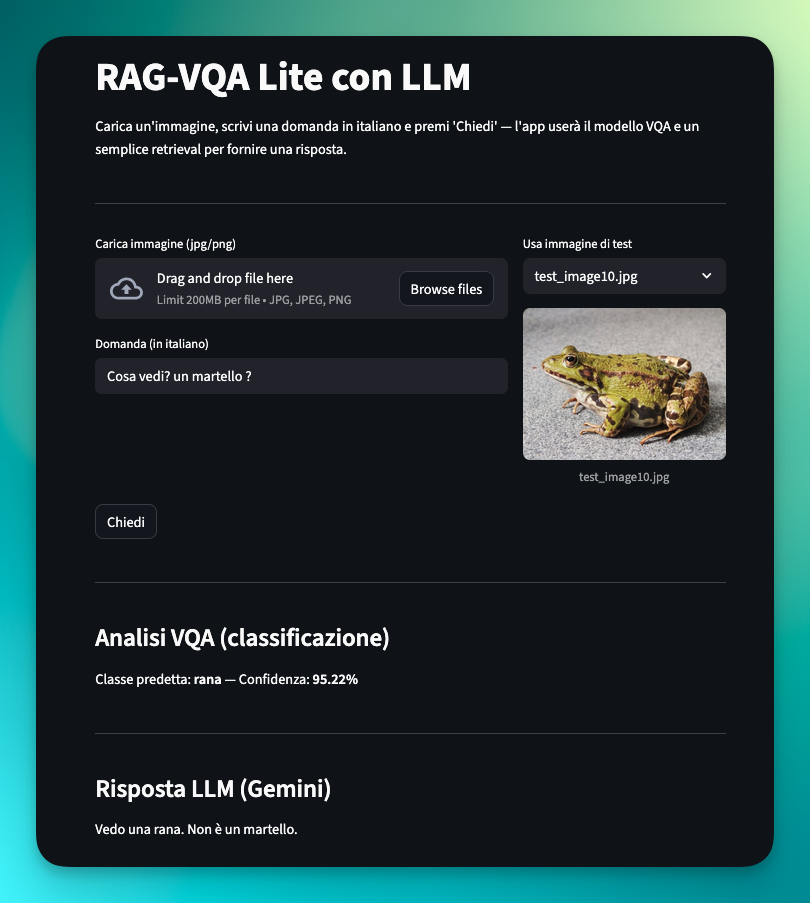
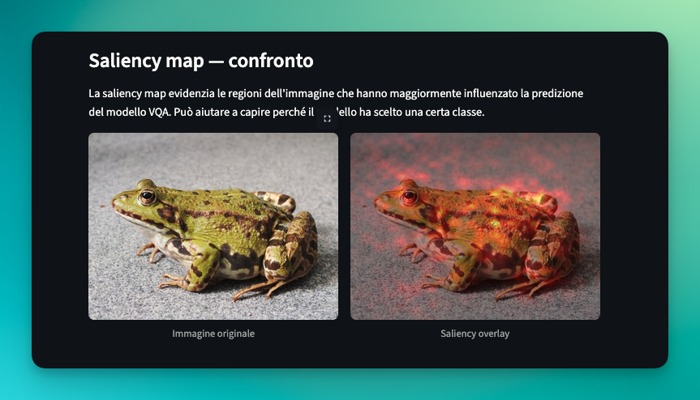

# 🧠 RAC_VQA_Lite
### Visual Question Answering con RAG & LLM Integration


**RAC_VQA_Lite** è un'applicazione di Visual Question Answering (VQA) che combina tecniche di Deep Learning classico con la potenza dei Large Language Models (LLM). Il sistema è in grado di analizzare un'immagine, comprendere una domanda in linguaggio naturale (italiano) e fornire una risposta accurata, arricchita da una spiegazione generativa.


---

## 🚀 Funzionalità Principali

*   **Analisi Visiva Profonda:** Utilizza una **ResNet18** pre-addestrata per estrarre feature visive complesse dalle immagini.
*   **Comprensione del Testo:** Sfrutta **Sentence-Transformers** (`all-MiniLM-L6-v2`) per creare embedding semantici delle domande dell'utente.
*   **Attention Mechanism:** Un modulo di attenzione personalizzato fonde le informazioni visive e testuali per focalizzarsi sulle aree rilevanti dell'immagine.
*   **Generazione LLM (RAG):** Integrazione opzionale con **Google Gemini** per generare risposte discorsive e spiegazioni dettagliate basate sulla classificazione del modello VQA.
*   **Interfaccia Intuitiva:** Web app interattiva realizzata con **Streamlit**.

## 🛠️ Architettura del Modello

Il cuore del sistema è la classe `VQANet`, che opera in tre fasi:
1.  **Image Encoding:** L'immagine viene processata da una ResNet18 (senza i layer finali) per ottenere una mappa di feature spaziali.
2.  **Question Encoding:** La domanda viene convertita in un vettore denso tramite SentenceTransformer.
3.  **Fusion & Classification:** Le feature vengono fuse tramite un meccanismo di attenzione che produce una distribuzione di probabilità sulle classi target (CIFAR-10).

---

## 📦 Installazione

1.  **Clona il repository:**
    ```bash
    git clone https://github.com/tuo-username/RAC_VQA_Lite.git
    cd RAC_VQA_Lite
    ```

2.  **Crea un ambiente virtuale (consigliato):**
    ```bash
    python -m venv .venv
    source .venv/bin/activate  # Su Windows: .venv\Scripts\activate
    ```

3.  **Installa le dipendenze:**
    ```bash
    pip install -r requirements.txt
    ```

## 🖥️ Utilizzo

Per avviare l'applicazione web in locale:

```bash
streamlit run app.py
```

L'app sarà accessibile nel browser all'indirizzo `http://localhost:8501`.

### Esempio di Workflow
1. Carica un'immagine (es. un aereo, un gatto, un'auto).
2. Scrivi una domanda: *"Che oggetto è questo?"* o *"C'è un gatto?"*.
3. Il modello classificherà l'oggetto e (se configurato) Gemini fornirà una descrizione contestuale.

> **Slot Immagine 2**
> *Inserisci qui uno screenshot del risultato dell'analisi con la risposta del modello.*
> 


> **Slot Immagine 1**
> *Inserisci qui uno screenshot della saliency map.*
> 

---

## 📂 Struttura del Progetto

```text
RAC_VQA_Lite/
├── app.py               # Entrypoint dell'applicazione Streamlit
├── RAG_VQA.ipynb        # Notebook per training, esperimenti e logica RAG
├── requirements.txt     # Elenco delle dipendenze
├── file/                # Cartella per pesi del modello e dataset
│   ├── vqa_model_best.pth  # Checkpoint del modello addestrato
│   └── *.npz               # Dataset pre-processati (embedding)
└── test_images/         # Immagini di esempio per i test
```

## 🔧 Configurazione Avanzata

Il file `app.py` contiene un dizionario `CFG` dove è possibile modificare i parametri del modello:
*   `question_dim`: Dimensione dell'embedding della domanda (default: 384).
*   `image_feature_dim`: Dimensione della proiezione visiva.
*   `embedding_model`: Modello HuggingFace utilizzato per il testo.

## 🤝 Credits

Sviluppato come progetto di Visual Question Answering ibrido. Utilizza dataset CIFAR-10 per il training delle classi base.

**Author:** Diego Scirocco
